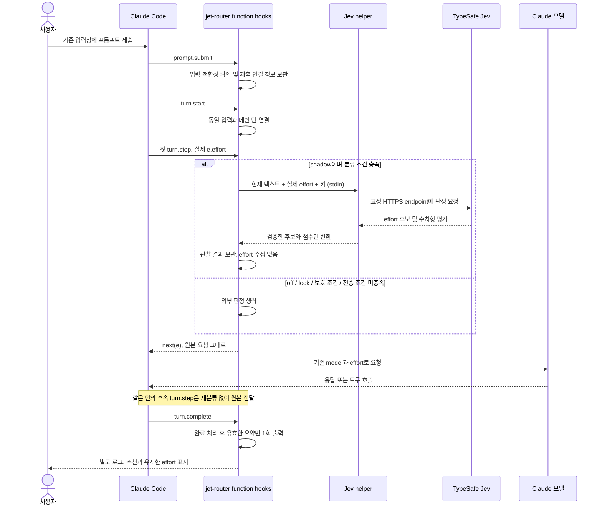
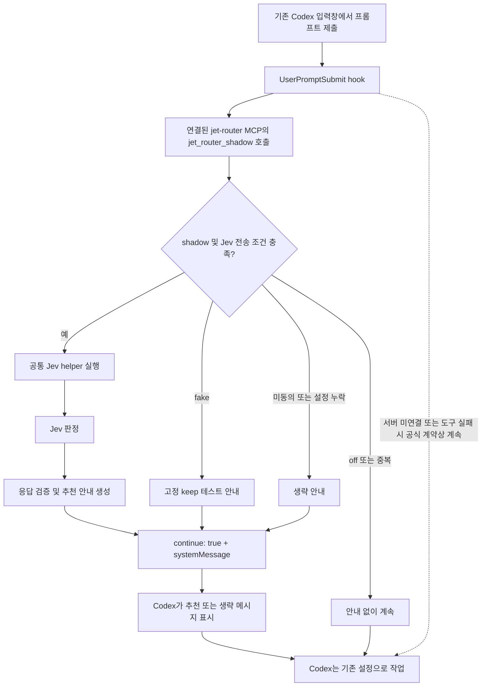
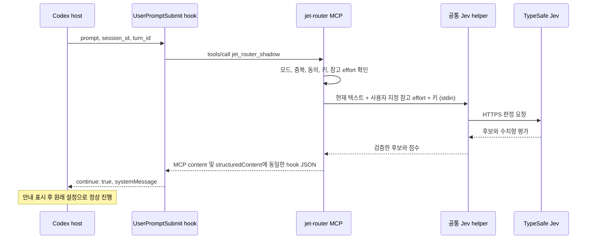
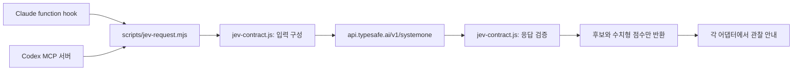
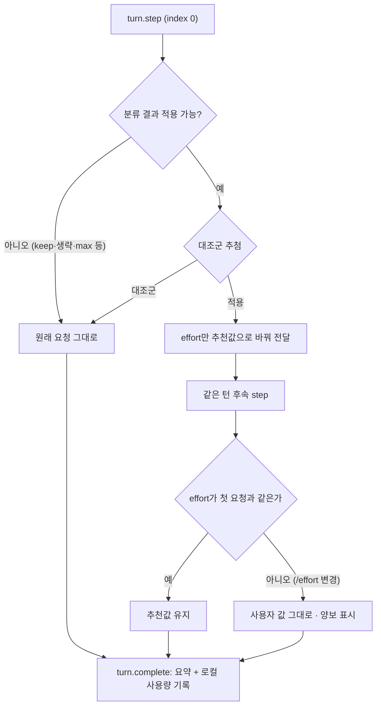
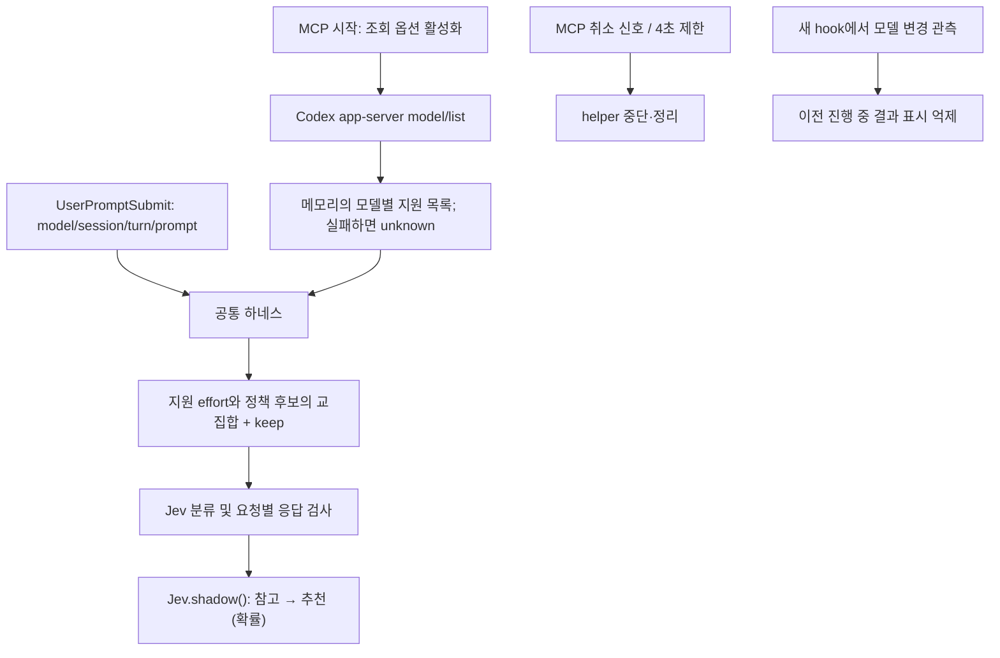

# Claude Code와 Codex의 Jev 작동 메커니즘

jet-router는 사용자 요청을 Jev에 보내 **필요한 effort 후보**를 얻는다.
현재 두 어댑터 모두 shadow이므로, 추천과 실제 적용은 분리되어 있다.
Jev가 코딩 작업을 수행하거나 Claude/Codex 설정을 직접 바꾸는 구조가 아니다.

**구현·검증 상태:** Claude는 function-hook mock 검증, Codex는 실제 MCP STDIO
연결 검증을 마쳤다. 두 클라이언트의 실제 설치·화면·요청 관찰은 수동 체크리스트 대상이다.
아래 host 흐름은 설정과 신뢰 승인이 완료된 경우의 설계이며, 실사용 완료 증거를 뜻하지 않는다.

## 한눈에 비교

| 항목 | Claude Code | Codex |
| --- | --- | --- |
| 연결 방식 | Claude function-hook 플러그인 | 로컬 MCP 서버 + lifecycle hook 설정 |
| 분류 시작 | 연결된 메인 턴의 첫 `turn.step` | `UserPromptSubmit`에서 MCP 도구 호출 |
| 실제 effort 읽기 | `turn.step`의 `e.effort` | 현재 hook 입력에는 제공되지 않음 |
| Jev에 전달하는 effort | 요청에서 읽은 실제 effort | 사용자가 설정한 참고 effort |
| Jev 전송 내용 | 현재 텍스트, effort, taskContext=null | 현재 텍스트, 참고 effort, taskContext=null |
| 안내 시점 | `turn.complete` 처리 후 | 입력 hook 처리 시점, 정상 작업 진행 전 |
| 안내 방식 | 별도 `$.ui.log` 한 줄 | hook `systemMessage`, UI 경고/이벤트 |
| 실제 effort 변경 | 없음, 원본 요청 객체 그대로 전달 | 없음, effort 제어 API를 호출하지 않음 |
| 활성화 | 새 세션 off → `/jet-router shadow` | 서버 기본 off → 환경 설정 shadow 후 재시작 |
| 중지 | `/jet-router off` 또는 lock | hook 비활성화 또는 서버 off 후 재시작 |

## Claude Code: 첫 요청 전에 판정하고 턴 종료 후 표시

`prompt.submit`에서 텍스트를 보관하고, `turn.start`와 정확히 연결한다.
분류는 이 시점이 아니라 **첫 `turn.step`에서 실제 effort를 읽은 뒤** 수행한다.



- 첨부·추가 context·긴 입력·큐/겹친 제출·연결 불명확 상태는 보수적으로 생략한다.
- subagent, 실제 max/알 수 없는 effort도 분류하지 않는다.
- hook은 판정을 최대 1초 기다린다. helper에는 별도로 HTTP 3초/프로세스 4초 제한이 있다.
  늦은 결과를 적용하지 않고, helper가 끝날 때까지 새 외부 분류를 겹쳐 시작하지 않는다.
- off/lock/세션 변경/턴 무효화 시 오래된 관찰 결과를 버린다.
- 한 턴에 도구 호출이 여러 번 있어도 Jev를 매 모델 요청마다 호출하지 않는다.

예상 메시지의 `medium 유지`는 hook이 전달한 요청 effort를 뜻한다.
아래 시간과 추천은 예시이며, 실제 서버에 전송된 요청의 추적 증거와는 구분한다.

```text
[jet-router] 관찰 · Jev · medium 유지 · 추천 low(미평가) · 분류 180ms
```

구현: [hooks/register.js](../hooks/register.js), [src/report.js](../src/report.js).
설정: [Claude 사용 가이드](usage.md).

## Codex: 입력 hook에서 MCP를 호출하고 즉시 안내

구현한 연결 방식은 다음과 같다.



Jev가 활성화된 정상 경로를 줄이면 사용자가 확인한 순서 그대로다.

```text
기존 Codex 입력창에서 프롬프트 제출
  → UserPromptSubmit hook
  → jet-router MCP
  → Jev 판정
  → 추천 메시지 표시
  → Codex는 기존 설정으로 작업
```

호출은 모델이 자율적으로 도구를 고르는 방식이 아니라 **설정된 lifecycle hook**이 담당한다.
따라서 MCP만 등록하고 hook을 설정하지 않으면 이 자동 흐름이 시작되지 않는다.
서버 연결과 `/hooks`의 신뢰 승인이 필요하다.



- 현재 effort를 임의로 medium/high/xhigh 중 하나로 추정하지 않는다.
  Jev의 필수 입력을 위해 `JET_ROUTER_REFERENCE_EFFORT`를 명시적으로 받는다.
- Codex 설정에서 실제 effort를 바꿔도 참고값이 자동 변경되지는 않는다.
  실제 max나 모델별 지원 목록도 이 hook으로 확인하지 못한다.
- 최근 256개 이벤트의 식별자로 한 MCP 프로세스 안에서 중복을 억제한다.
  Jev 실행 중 다른 호출은 기다리지 않고 생략한다.
- transcript·파일·첨부·이전 대화를 읽지 않는다. 이 때문에 Claude 쪽 입력 보호와
  동등한 맥락 검증을 제공한다고 볼 수 없다.
- 정상 결과는 항상 `continue: true`다. 차단·추가 모델 지시·effort 변경 필드를 반환하지 않는다.
- 오류·timeout은 분류 생략으로 처리한다. 이미 전송한 요청은 취소나 off로 회수되지 않는다.

예상 안내는 실제 적용값을 모른다는 점을 명시한다.

```text
[jet-router] Jev.shadow(): high → medium (70%)
```

구현: [mcp/server.mjs](../mcp/server.mjs), [mcp/shadow.mjs](../mcp/shadow.mjs).
설정·수동 검증: [Codex MCP 가이드](codex-mcp.md).
공식 계약: [Codex Hooks](https://learn.chatgpt.com/docs/hooks).

## 두 도구가 공유하는 판정 경로



Jev 후보는 `low / medium / high / xhigh / keep`이며, `keep`은 effort 이름이 아니라
변경 추천을 보류한다는 뜻이다. confidence, contextScore, riskScore도 검증하지만
임의의 임계값으로 자동 적용 정책을 만들지 않는다. 현재 안내의 `미평가`는 이 정책·품질
평가가 끝나지 않았다는 뜻이다.

전송 대상은 고정 HTTPS endpoint다. redirect·자동 재시도·다른 provider fallback은 없다.
키는 각 host의 설정에서 helper stdin으로 전달하며, 응답 본문이나 키를 안내에 포함하지 않는다.
두 host는 키 저장소나 활성화 설정을 서로 공유하지 않는다.

## enforce와 shadow의 차이

shadow는 값을 바꾸지 않으므로 **턴 종료 후 복귀시킬 effort 자체가 없다.**

Claude enforce(0.4.0~)는 `turn.step`에 들어온 요청 객체의 effort만 추천값으로 바꿔 넘긴다.
설정 파일·세션 기본값을 수정하지 않으므로 복귀 작업이 필요 없고, 다음 턴은 원래 값으로 새로 분류한다.
같은 턴의 도구 루프 요청에는 계속 적용하며, 들어오는 effort가 첫 요청과 달라지면(턴 도중 `/effort`)
그 턴의 남은 요청은 사용자 값을 그대로 넘긴다. keep·같은 effort·분류 생략·max·subagent·잠금은 적용하지 않는다.
적용 대상 중 `holdoutRate`(기본 0.1) 비율은 무작위로 적용하지 않고 대조군으로 기록한다.
재작성이 요청과 서버 동작에 반영되고 설정에 남지 않음은 [경로 확인 기록](evaluations/enforce-path-2026-09-28.md)에서,
실제 세션 동작은 0.4.0 설치 후 확인했다.



Codex의 MCP hook 출력에는 effort 변경 계약이 없다. 실제 적용에는 별도 제어 클라이언트가
필요하며, [App Server](https://learn.chatgpt.com/docs/app-server)의 `turn/start.effort`는
다음 턴에도 기본값으로 남는다. 따라서 한 턴만 적용하려면 사용자 기본값·수동 변경을
별도로 추적하고 매 턴 명시적으로 전달하는 설계가 필요하다. 이번 구현에는 포함하지 않는다.


공통 하네스 v2 연결: 현재 프롬프트와 effort 출처를 공통 입력으로 전달한다.
모델 지원 범위·맥락 미확인은 `uncertainties`로 Jev에 전달하고 shadow 추천을 허용한다.
동의·입력·응답 검사는 유지한다. 세부 정보와 검증 한계는 [하네스 가이드](harness.md)를 참고한다.


## Codex 지원 범위와 취소 경로



실제 effort는 바꾸지 않는다. 모델 변경은 hook으로 관측한 범위에서만 감지한다.
Codex Escape의 즉시 취소 전달 한계와 검증 범위는 [마무리 기록](evaluations/shadow-closeout-2026-09-27.md)에 남겼다.
