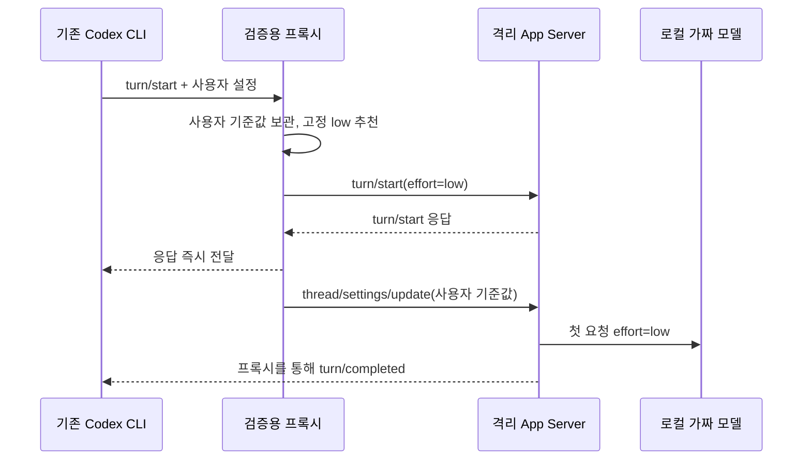

# Codex turn/start 프록시 검증

2026-09-28, 기준 소스 `e9670d7`, Codex CLI 0.158.0.

## 결과

기존 CLI의 `--remote unix://…`로 검증용 프록시에 연결해 **첫 모델 요청부터 low**를 전달했다.
별도 입력창을 만들지 않았다. 다만 평소 실행 중인 CLI 세션에 끼워 넣은 것이 아니라,
프록시를 대상으로 새 CLI를 실행한 검증이다. VS Code/데스크톱 세션 지원을 뜻하지 않는다.

별도 프로토콜 클라이언트에서는 다음 네 턴을 같은 thread에서 확인했다.

| 턴 | 사용자 기준값 | 고정 추천 | 첫 HTTP 요청 effort | 완료 후 설정 |
| --- | --- | --- | --- | --- |
| 1 | medium | low | low | medium |
| 2 | medium | 유지 | medium | medium |
| 3 | high로 수동 변경 | low | low | high |
| 4 | high | 유지 | high | high |

5번째 턴은 실제 Codex TUI를 PTY에서 실행했다. `PROBE_LOW reply ok`를 초기 입력으로 전달했고,
프록시의 `turn/start` 관측, HTTP effort low, `turn/completed`를 확인했다.
TUI의 collaborationMode 설정도 effort보다 우선하므로 같은 추천값으로 맞췄다.
수동 high 변경은 `thread/settings/update`로 검사했으며 `/model` 메뉴 조작 검증은 아니다.

총 5턴·5개 모델 HTTP 요청, 모두 completed. [기계 판독 결과](evidence.json).
OpenAI/Jev의 실제 모델 생성은 없고 loopback 가짜 Responses 서버가 고정 응답을 반환했다.
이는 전송/설정 경로 증거이며 실제 모델 품질·비용 검증이 아니다.

## 작동 방식



복귀는 현재 턴을 건드리지 않는 후속 턴 설정 API를 사용한다. 변경값이 이후 턴에 남을 수 있는
`turn/start` 특성을 처리하기 위한 실험이다. 모델 요청과 복귀 응답의 세부 순서는 비동기다.

초기 probe는 복귀 완료까지 `turn/start` 응답을 보류했다. 빠른 mock 응답에서 CLI 추가 요청이
관측됐고, 종료 전 assertion과 저장한 결과의 요청 수가 달랐다. 응답을 즉시 전달하고
CLI 종료 후 요청 수까지 검사하도록 수정했다. 수정 후 5요청으로 일치했다.
이 관측만으로 모든 중복 요청의 원인이 해결됐다고 일반화하지 않는다.

## 재현

```sh
python3 scripts/probe-codex-start-proxy.py
```

- Python 표준 라이브러리, 설치된 Codex, Unix socket/loopback/PTY 권한 필요.
- 새 임시 CODEX_HOME, read-only sandbox, 로컬 가짜 provider만 사용.
- 기존 설정·세션·MCP·hook 신뢰를 변경하지 않는다.
- `PROBE_LOW`라는 합성 마커만 low로 변환한다. Jev를 호출하지 않는다.
- 스크립트는 실제 CLI 요청까지 assertion하고 자체 프로세스를 종료한다.
- 임시 폴더에 backend log, 합성 CLI 출력, evidence.json을 남긴다.
- 실행 종료 코드 0. Python 구문·JSON·로컬 문서 링크·`git diff --check` 통과.

## 제품 구현 전 남은 조건

이 스크립트는 **검증 전용**이며 일반 프록시나 배포 기능이 아니다.
한 연결의 직렬 테스트만 다루며 원문 마커 로그도 합성 입력에 한정된다.

1. 공통 Jev 요청 계약과 모델별 지원 범위를 연결하고 실패·지연 시 사용자 설정 유지.
2. 연결 단절·복귀 API 실패 시 low가 다음 턴에 남는 상황을 처리.
3. 복귀와 사용자 수동 변경의 경쟁, 여러 클라이언트, 동시 턴, 재연결·resume 검증.
4. 취소·모델 변경·plan/default 모드·도구 승인 흐름과 요청/응답 ID 충돌 처리.
5. 실제 Jev 및 모델 호출로 품질/비용을 별도 확인. Claude 실호출은 계속 스킵.

설치 MCP만 갱신해도 기존 세션에 프록시가 자동 적용되는 구조는 아니다.
제품화 시 별도 실행 명령/연결 안내가 필요하며, 현재 세션은 shadow를 유지한다.
