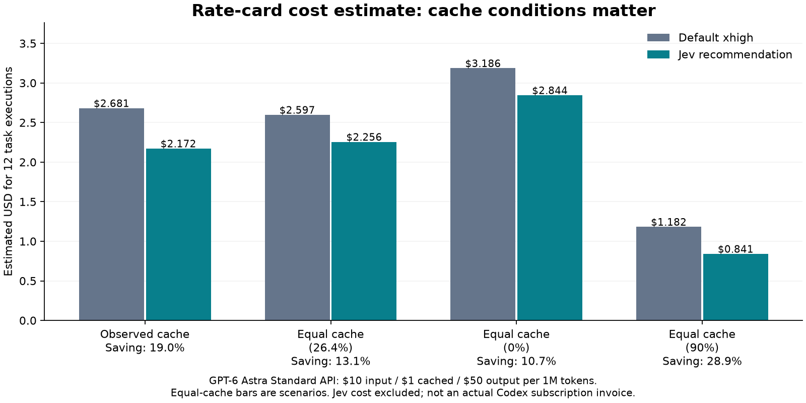
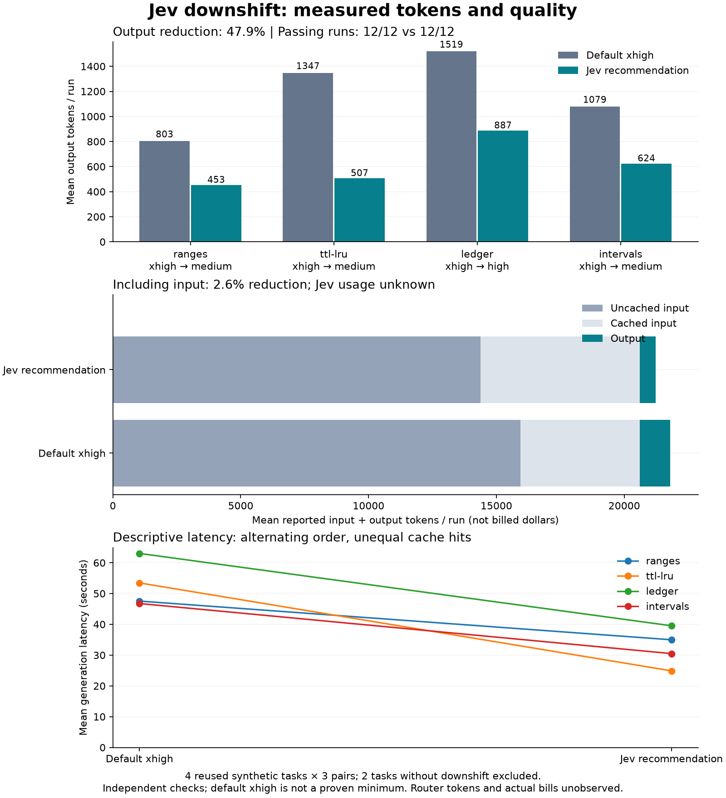

# Jev 하향 추천을 실제 적용했을 때의 토큰 비교

## 측정 결과와 결론

**이 합성 과제군에서는 하향 추천의 절감 신호가 관측됐다.** 네 과제의 12개 비교 쌍 모두 추천값의 출력 토큰이 적었고, 양쪽 12/12가 독립 검사를 통과했다. 저장된 24개 코드를 다시 실행해 동일 결과를 확인했다. 품질 회귀는 관측되지 않았지만 작은 검사 집합에서의 결과다.

| 항목 | 기본 xhigh | Jev 추천 |
| --- | ---: | ---: |
| 검사 통과 | 12/12 | 12/12 |
| 입력 토큰 | 247,366 | 247,380 |
| 입력 중 캐시 토큰 | 56,064 | 74,752 |
| 출력 토큰(추론 포함) | 14,243 | 7,414 |
| 출력 중 추론 토큰 | 8,553 | 1,953 |
| 생성 지연 합계 | 632.4s | 389.7s |

출력 토큰 **47.9% 감소**, 입력+출력 토큰 합계 **2.6% 감소**다. 출력 감소 6,829개 중 추론 감소는 6,600개다. 입력의 큰 고정 비용 때문에 전체 토큰 감소율은 작지만, 더 비싼 출력 단가를 적용하면 예상 비용 차이는 커진다.

| 과제 | 추천 | xhigh 출력 합계 | 추천 출력 합계 | 출력 절감 | 통과 |
| --- | --- | ---: | ---: | ---: | --- |
| ranges | medium | 2,409 | 1,360 | 43.5% | 각각 3/3 |
| ttl-lru | medium | 4,042 | 1,520 | 62.4% | 각각 3/3 |
| ledger | high | 4,556 | 2,661 | 41.6% | 각각 3/3 |
| intervals | medium | 3,236 | 1,873 | 42.1% | 각각 3/3 |

**xhigh 유지:** async-memo, keyed-queue. 이 둘은 하향 비교에서 제외했다. 포함/제외는 생성 결과를 보기 전에 Jev 판정으로 결정했다.

## 공식 단가 적용 예상 비용

아래는 [공식 모델 단가](https://developers.openai.com/api/docs/models/gpt-6-astra)를 적용한 설정별 **12회 실행 합계**, Jev 비용 제외다. 같은 캐시 조건으로 계산한 13.1%와 관측 캐시를 반영한 19.0%를 구분한다.

| 캐시 조건 | 기본 xhigh 예상 USD | 추천 예상 USD | 예상 절감률 | 요청당 절감 USD |
| --- | ---: | ---: | ---: | ---: |
| 관측 캐시 그대로 | $2.6812 | $2.1717 | 19.0% | $0.04246 |
| 동일 캐시 비율 26.44% | $2.5972 | $2.2558 | 13.1% | $0.02845 |
| 양쪽 캐시 0% 가정 | $3.1858 | $2.8445 | 10.7% | $0.02844 |
| 양쪽 캐시 90% 가정 | $1.1821 | $0.8407 | 28.9% | $0.02845 |

관측 캐시 입력 비율은 xhigh **22.66%**, 추천 **30.22%**로 달랐다. 관측 예상 절감 $0.5095 중 출력 비용 감소는 $0.34145, 입력·캐시 비용 차이는 $0.168052다. 따라서 관측 19.0%를 effort 변경만의 효과라고 볼 수 없다.

Codex Standard 크레딧 추정은 관측 기준 **67.0309 → 54.2933 credits**, 동일 캐시 기준 **64.9289 → 56.3953 credits**다. 실제 구독 청구액이나 포함 사용량 절약을 확인한 값은 아니다.

과제별 캐시 영향을 숨기지 않기 위해 비용 증감도 분리했다. 음수는 비용 증가다.

| 과제 | 관측 캐시 비용 절감률 | 동일 캐시 비율 비용 절감률 |
| --- | ---: | ---: |
| ranges | 9.2% | 8.9% |
| ttl-lru | 35.8% | 18.7% |
| ledger | -47.2% | 13.5% |
| intervals | 52.0% | 10.8% |

**Jev 비용의 손익분기점:** 동일 캐시 기준 요청당 총 절감 여지는 약 **$0.02845**다. 품질을 유지하고 추가 재시도·수정이 없다는 가정에서 Jev 1회 비용이 이보다 낮아야 순절감이 남는다. 실제 Jev 비용은 알 수 없으며 유지 추천을 받는 요청에도 라우터 비용이 발생하므로 전체 사용 패턴의 손익분기점은 달라진다.

Jev 분류 지연은 6회 평균 274ms(범위 249–290ms)였다. 생성 지연은 순차 실행·서버 상황·캐시 영향을 받으므로 별도 관측치로만 본다.

## 그래프





[비용 SVG](costs.svg) · [토큰 SVG](comparison.svg) · [요약 JSON](summary.json) · [비용 계산 JSON](cost-summary.json) · [생성 코드와 측정 원본](routes-runs.json)

## 판단과 다음 검증

사전 기준인 출력 10% 이상 절감·관측 품질 회귀 없음은 충족했다. 다만 독립 과제는 4개뿐이고 탐색적 과제 단위 sign-flip p=0.0625이므로 통계적으로 확정된 일반 효과라고 표현하지 않는다. 기본 medium/high 사용자, 다른 모델, 긴 대화나 실제 저장소 수정, 모든 요청의 순비용으로 일반화하지 않는다.

이 결과는 **현재 xhigh를 쓰는 상황에서 Jev 하향 추천을 적용해 볼 근거가 되는 파일럿**이다. 최소 필요 effort 판정 정확도와 실제 작업의 품질 보장을 입증한 것은 아니다. 다음 검증은 새 저장소 과제·더 많은 독립 과제·순서 무작위화·라우터 비용 계측이 적절하다.

검증: `npm test` 101/101, 전체 저장 코드 24개 재검사, paired session/프롬프트·코드·검사 해시 확인, 가격 계산 회귀 테스트, SVG XML 검사 및 `git diff --check` 종료 코드 0. 기반 제품 커밋은 `15694f4`; 제품 판정 지침·enforce는 변경하지 않았다.


## 질문과 비교 범위

사용자가 기본 xhigh로 실행하려던 작업을 Jev 추천 medium/high로 낮추면, 검사 통과를 유지하며
토큰이 줄어드는지 측정한다. **xhigh는 사용자 기본값을 가정한 대조군이지, 그 작업에 반드시 필요한 최소 effort가 아니다.**
최소 충분 effort를 찾으려면 모든 effort의 추가 반복과 더 넓은 품질 검증이 필요하다.
위 절감률의 분모는 **하향 추천된 4과제의 실행 비용**이다. xhigh 유지 2과제의 생성 비용은 포함하지 않았으므로,
jet-router를 사용하는 모든 요청의 평균 절감률로 확대 해석하지 않는다.

현재 제품은 shadow이며 effort를 자동 변경하지 않는다. 이번에는 실제 제품의 Jev 분류기와 하네스(v3)로 추천을 받고,
평가 스크립트가 Codex 독립 세션에 추천 effort를 명시적으로 지정했다. 따라서 추천대로 수동 변경했을 때의
생성 비교에 해당하며, hook/enforce 경로 전체의 검증은 아니다.

- Codex CLI 0.157.1 / gpt-6-astra. 2026-09-28 KST.
- [결과 전 고정한 프로토콜](protocol.md), [실제 Jev 추천](routes.json).
- 기존 합성 과제 6개 모두 조회. 하향 추천 4개를 전부 포함했고, xhigh 유지 2개는 하향 비교에서 제외.
- 과제별 3회 × 2개 설정 = 24개 새 세션. 과제 명세·숨겨진 검사 고정, 수정 피드백 없음.
- 과제/반복에 따라 두 설정의 호출 순서를 번갈아 배치. 동시 실행과 자동 재시도 없음.
- 기존 평가에서 사용한 과제 재사용이며 새 holdout이 아니다. Jev 추천은 한 번 조회해 고정했으므로 판정 안정성 실험도 아니다.
- production과 같이 context.missingRequired=null을 전달했다. 추천 실패나 보류를 임의의 하향값으로 대체하지 않았다.

## 해석 규칙

출력 토큰은 Codex가 보고한 `output_tokens`, 추론 토큰은 별도 보고값이다. 둘을 다시 더하지 않는다.
캐시 토큰은 입력에 포함된 부분으로 따로 표시하며, 입력+출력 합계가 곧 청구액은 아니다.
Jev 호출의 토큰/청구액은 이 어댑터에서 노출되지 않으므로 **라우터 비용을 포함한 순절감은 미확인**이다.
라우팅 지연은 6회 관측하고, 코드 생성 지연과 구분했다.

세 번의 코드 생성 반복은 샘플이다. 통과는 정의된 검사 범위의 성공이며 전체 요구사항 완전성이나
다른 모델·실제 저장소 작업의 품질 보장이 아니다. baseline 통과/recommended 실패 쌍을 품질 회귀로 집계한다.

과제 단위 평균 토큰 차이에 대한 단측 sign-flip 값은 탐색적 참고값이다. 4개 과제에서는 전부 절감해도
최솟값이 0.0625다. 과제의 독립성/차이의 대칭성은 확인하지 않았으며, 순서도 무작위화가 아닌 교대 방식이므로
이를 확정적인 통계적 유의성 근거로 사용하지 않는다. 같은 과제의 3회 반복을 독립 과제 3개로 세지 않는다.

## 재현

```sh
# 실제 모델 호출. 새 출력 경로를 사용하고 키는 환경 파일로 전달한다.
node scripts/compare-downshift.mjs route /tmp/new-downshift.json /absolute/path/to/.env
node scripts/compare-downshift.mjs run /tmp/new-downshift.json

# 저장 코드만 재검사·요약. 모델 호출/키 접근 없음.
node scripts/summarize-downshift.mjs \
  docs/evaluations/downshift-2026-09-28/routes-runs.json \
  docs/evaluations/downshift-2026-09-28/summary.json
# matplotlib이 설치된 별도 Python 환경
python scripts/plot-downshift.py docs/evaluations/downshift-2026-09-28
```

## 요금 예측의 근거

2026-09-28 확인한 [GPT-6 Astra 공식 API 단가](https://developers.openai.com/api/docs/models/gpt-6-astra)는
Standard·짧은 컨텍스트에서 100만 토큰당 입력 $10, 캐시 입력 $1, 출력 $50, 캐시 쓰기 $12.50이다.
이번 실행은 요청별 약 2만 입력 토큰으로 272K 초과 장문 할증 기준보다 작고 cache_write_input_tokens=0인지 검사한다.
[공식 추론 문서](https://developers.openai.com/api/docs/guides/reasoning)에 따라 추론은 출력 과금에 포함하며 중복 가산하지 않는다.

[Codex 공식 크레딧 단가](https://learn.chatgpt.com/docs/pricing)는 Standard에서 100만 토큰당 입력 250,
캐시 입력 25, 출력 1,250 credits다. 크레딧 가격만으로 구독 포함 사용량을 결정할 수 없고 구매 조건도 달라,
크레딧을 실제 지출 달러로 환전하지 않았다. [확인 시점과 단가 데이터](pricing.json)를 함께 저장했다.

이번 데이터에 적용한 API 추정식:

```text
USD = ((input_tokens - cached_input_tokens) × 10
       + cached_input_tokens × 1
       + output_tokens × 50) / 1,000,000
절감률 = (기본값 비용 - 추천값 비용) / 기본값 비용
```

이는 API Standard로 같은 토큰을 소비했을 경우의 모형이다. 실제 서비스 등급·계약·할인·세금·환율·Jev 비용은 반영하지 않는다.
관측 캐시 그대로와 두 설정에 같은 캐시 비율을 가정한 값을 분리한다. 캐시를 통제한 실행을 새로 했다는 뜻은 아니다.

```sh
node scripts/price-downshift.mjs \
  docs/evaluations/downshift-2026-09-28/routes-runs.json \
  docs/evaluations/downshift-2026-09-28/pricing.json \
  docs/evaluations/downshift-2026-09-28/cost-summary.json
```
