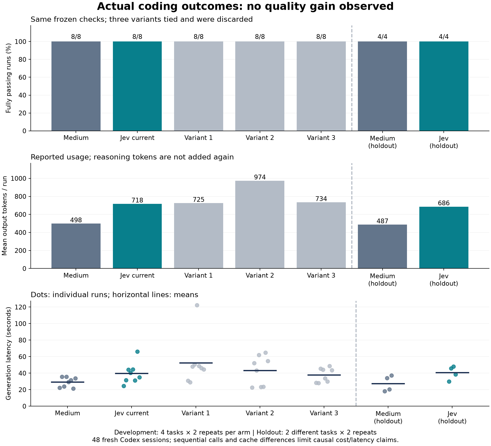

# 실제 코드 실행 기반 품질 비교

2026-09-27에 시작해 2026-09-28(KST)까지 이어진 실험이다. 기존 추천 레이블 평가를 보완하기 위해 **생성 코드를 실제 실행**했다.
[사전 고정 프로토콜](protocol.md), [과제 명세](../../../eval/task-quality/tasks.mjs),
[생성 모델에 제공하지 않은 검사](../../../eval/task-quality/grade.mjs).
평가기 구현 커밋은 `90453ef`다. 지침 변경은 Jev의 effort 선택에만 영향을 주며, 코드를 생성하는 Codex의 과제 프롬프트는 모든 arm에서 같다.
모든 과제는 새 합성 JavaScript 모듈이다. 기존 프로젝트의 전체 유지보수 성능은 평가하지 않는다.

Codex CLI 0.157.1 / gpt-6-astra, 독립 ephemeral 세션과 명시적 model_reasoning_effort를 사용한다.
[공식 비대화형 실행 문서](https://learn.chatgpt.com/docs/non-interactive-mode),
[설정 참조](https://learn.chatgpt.com/docs/config-file/config-reference)를 확인했다.
사용자 설정과 hook은 불러오지 않는다. 모델은 명세만 받고 도구를 사용하지 않으며,
독립 Node 프로세스가 결과물을 검사한다. 모델이 도구를 쓰거나 생성에 실패하면 무효 실행으로 기록한다.

CLI에 요청한 effort와 생성 코드는 확인했다. API wire 수준의 reasoning 설정은 관측하지 않았다.
제품 shadow가 effort를 변경했다는 뜻이 아니며, 평가 실행기가 독립 세션에 명시적으로 설정한 것이다.
입출력/추론 토큰은 Codex turn.completed가 보고한 값이다. 실제 청구액이나 금액 절감은 미확인이다.

## 평가기 사전 검증 및 수정

- 정상 참고 구현 6개가 모든 검사를 통과했다.
- API가 없는 구현 6개 및 의도적으로 넣은 범위/만료 경계, 오래된 세대 삭제,
  자기 이체 overflow, 키별 직렬성, 구간 경계 버그 6개를 거부했다.
- 첫 medium 실행의 모듈 로딩은 macOS 임시 경로 별칭과 Node permission 검사 때문에 실패했다.
  실제 경로 정규화로 고쳤다. 모델 응답은 재생성하지 않고 **동일 코드·동일 테스트**로 재검사했다.
  medium-run/original-grader-path-error.json을 원본으로 보존하고 report.json에 수정 사유를 기록했다.
  테스트 명세나 assertion은 바꾸지 않았다. 이 인프라 오류를 모델 품질 실패로 집계하지 않았다.

## 재실행

평가 설정 JSON에는 각 과제에 실제로 요청할 effort와 원래 Jev 응답을 기록한다.
`keep`은 기본 medium으로 매핑한다. 같은 effort여도 각 arm은 새 세션에서 다시 코드를 생성한다.

```sh
node scripts/run-task-quality.mjs <config.json> /tmp/new-output-directory
node scripts/summarize-task-quality.mjs <output-directory>/report.json
```

첫 명령은 실제 Codex 모델을 호출한다. 저장된 응답만 재검사하려면 아래 verify-task-results 명령을 사용하며 모델 호출이 없다.
출력 디렉터리는 기존 경로를 덮어쓰지 않는다. 각 생성은 최대 180초, 검사 프로세스는 최대 5초다.
테스트 결과는 작은 과제군의 관측치이며, 범용 정확도나 모델 간 품질 보장을 뜻하지 않는다.


## 개발 과제 결과

| 설정 | 성공 | 출력 토큰 합계 | 추론 토큰 보고값 | 총 지연 |
| --- | --- | --- | --- | --- |
| medium 고정 | 8/8 | 3,985 | 758 | 233.6s |
| 현재 Jev | 8/8 | 5,742 | 2,639 | 318.1s |
| 변경안 1: 다중 불변식 강조 | 8/8 | 5,801 | 2,699 | 420.2s |
| 변경안 2: 경계 조건 상호작용 | 8/8 | 7,791 | 4,587 | 346.1s |
| 변경안 3: 독립 검증 난도 | 8/8 | 5,872 | 2,756 | 302.2s |

세 변경안 모두 동률로 폐기했다. 연속 3회 실제 성공률 개선이 없어 중단 조건을 충족했다.
모든 과제가 이미 기준선에서 통과해 평가 상한에 도달했다. 이를 최대 품질 달성이나
일반적인 최적 effort 발견으로 해석하지 않는다. 이번 루프에서는 제품 판정 지침을 추가 변경하지 않는다.

현재 Jev의 출력 토큰은 medium 대비 약 44% 더 많았다. 추론 토큰 보고값을 출력 토큰에 다시
더해 청구 토큰을 계산하지 않는다. 캐시 적중량·호출 시점·서비스 지연이 달라 지연/비용의
인과 효과를 확정할 수 없다. 실제 금액 절감이나 추천으로 인한 품질 향상은 확인하지 못했다.

## 최종 별도 과제와 결과 감사

| 설정 | 성공 | 출력 토큰 합계 | 추론 토큰 보고값 | 총 지연 |
| --- | --- | --- | --- | --- |
| medium 고정 | 4/4 | 1,948 | 716 | 110.0s |
| 현재 Jev | 4/4 | 2,746 | 1,534 | 162.3s |

개발 과제와 다른 keyed-queue/intervals를 사용했다. 총 48개 독립 세션의 생성 코드를
오프라인에서 다시 실행해 모두 통과했다. 과제·검사·프롬프트·코드 해시, 세션 ID 중복,
요청 effort, 도구 미사용도 검사했다. 최종 과제를 보고 지침을 다시 조정하지 않았다.

```sh
node scripts/verify-task-results.mjs docs/evaluations/task-quality-2026-09-27
# {"verified":true,"taskRuns":48,"uniqueSessions":48,"liveCalls":0}
```

## 시각화와 해석



[벡터 그래프 SVG](outcomes.svg). 과제 수가 다른 개발/holdout은 분리 표시했다.
토큰은 실행당 평균, 지연은 개별 값과 평균이다. 개발 과제와 holdout의 난도는 같지 않다.

```sh
# 별도 Python 환경에 matplotlib 설치 후 (실험 생성 호출 없음)
python scripts/plot-task-quality.py docs/evaluations/task-quality-2026-09-27
```

[autoresearch](https://github.com/karpathy/autoresearch)의 고정 평가·단일 가설 변경·측정 후 채택/폐기·
실험 기록 방식을 적용했다. 원본의 학습 손실 대신 독립 검사 통과율을 사용했다.
세 번의 동률은 이 과제군에서 추가 채택 근거가 없다는 의미다.
더 어려운 실제 저장소 과제, 더 많은 반복, 호출 순서 무작위화가 다음 평가 후보이며,
이번 결과를 바꾸기 위해 사후에 과제나 합격 기준을 조정하지 않았다.
Claude 실사용과 제품의 실제 effort 변경/복귀는 검증 범위 밖이다.

최종 로컬 검증: 루트 테스트 95/95, MCP 29/29, 오프라인 Claude hook 2/2,
두 plugin manifest strict validation, 전체 48개 코드 재검사, `git diff --check` 모두 종료 코드 0.
그래프는 Python 3.12 / matplotlib 3.11.2로 생성했다. Claude hook 검사는 실제 모델 실행이 아니다.
