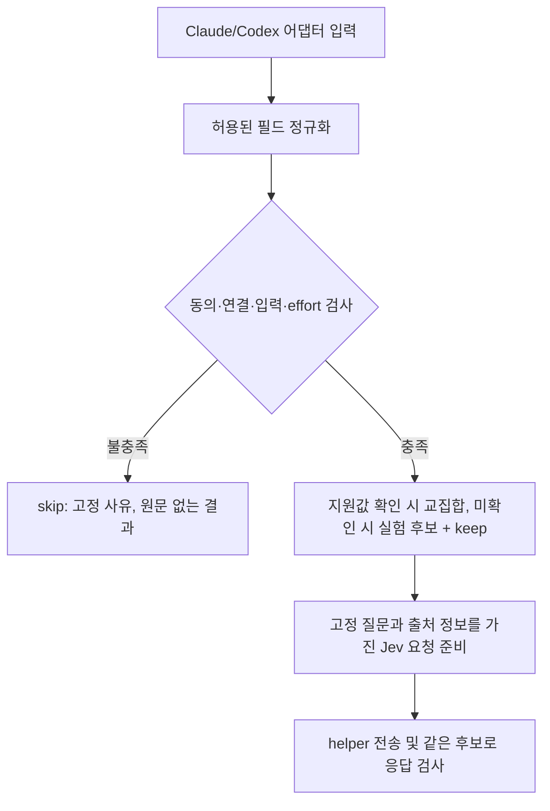

# 공통 요청 하네스 — shadow 연결

**Claude/Codex Jev shadow 어댑터가 공통 하네스와 helper를 사용한다.**
연결은 오프라인 훅·모의 전송으로 검증했다. 새 기준의 [실제 MCP/Jev 호출 3건](evaluations/harness-v2-live-smoke-2026-09-27.md)은 성공했다. 추천 품질 평가는 아직 하지 않았다.
이번 단계는 요청 계약을 검증하며, Jev 추천 정확도·실제 host 호환성·enforce를 검증하지 않는다.

## 실행

저장소 루트에서 Node 22+로 실행한다. 추가 의존성은 없다.

```sh
node scripts/evaluate-harness.mjs --dry-run
node --test tests/harness.test.mjs tests/harness-evaluation.test.mjs
```

실행기는 저장소의 합성 fixture 14개만 사용한다. 키·환경·파일 입력을 받지 않고,
네트워크·자식 프로세스·live 모드를 제공하지 않는다. 출력은 버전, 사례 ID,
통과 여부, 요청 크기·해시다. 원문·요약·이벤트 ID·키는 출력하지 않는다.
`--live`나 임의 입력 옵션은 exit 1로 거부한다.

## 공통 입력 계약

[src/harness.js](../src/harness.js)의 `prepareRoutingRequest(input)`에 전달한다.
어댑터는 확인 가능한 필드만 채우고 나머지는 null로 둔다.

| 필드 | 의미와 제한 |
| --- | --- |
| `host` | `claude-code` 또는 `codex` |
| `prompt` | 현재 사용자 텍스트, 공백만인 입력 거부, 최대 6,000자 |
| `cloudConsent` | 명시적 boolean; false이면 준비 생략 |
| `target.model` | 실제 작업을 수행할 모델 식별자, 미확인은 null |
| `target.source` | `host` 또는 `unknown`; 모델이 추측한 값은 host로 인정하지 않음 |
| `target.supportedEfforts` | host가 확인한 지원값 배열, 미확인은 null |
| `effort.value` | 현재 effort 또는 사용자 지정 참고값, 미확인은 null |
| `effort.source` | `host`, `user-reference`, `unknown` |
| `event` | sessionId, turnId, correlated; 연결 확인 전에는 correlated=false |
| `context.source` | `prompt-only`, `user-provided`, `model-summary` |
| `context.text` | prompt-only는 null, 나머지는 명시적으로 제공한 텍스트 최대 2,000자 |
| `context.missingRequired` | 필요한 입력이 빠졌는지에 대한 어댑터 상태. true/null은 불확실성으로 전달 |

출처 표기는 인증 수단이 아니다. 어댑터가 신뢰 가능한 host API/사용자 설정에서 값을 채워야 하며,
모델이나 MCP 인자가 `source: host`라고 주장하는 것을 그대로 받아서는 안 된다.
`missingRequired=false`는 완전한 의미 이해나 맥락 충분성을 증명하지 않는다.
확인할 수 없는 경우 null을 유지하며, 향후 Jev 맥락 판정의 별도 평가도 필요하다.

1단계는 transcript나 파일을 자동 수집하지 않는다. 모델 요약은 unverified 데이터로 표시한다.
입력에 임의로 추가된 키·questions·기타 속성은 복사하지 않는다. 허용된 prompt/context에 직접
포함된 민감정보를 탐지·제거하는 기능은 아니다. 런타임은 현재 프롬프트만 전송하고 맥락 요약을 자동 수집하지 않는다.

## 요청 전 검사와 출력



- `ready`: 정규화 입력, 준비된 요청, 후보 목록, 버전 정보를 반환한다.
  **shadow 평가 요청을 만들 수 있다는 뜻이며 자동 적용 승인이 아니다.**
- `skip`: 고정 reason과 버전만 반환하며 요청·정규화 입력을 포함하지 않는다.
- 모든 결과는 `enforceEligible: false`다. 모델 허용 목록이나 실제 적용은 구현하지 않았다.
- 후보는 기존 평가 기준이 있는 low/medium/high/xhigh와 host 지원값의 교집합에 keep을 더한다.
  max는 보호 대상으로 생략한다. none 기준은 아직 없으므로 현재 effort가 none이면 생략한다.
- 모델·지원값·맥락·세션 ID 미확인은 `uncertainties`로 기록하고 shadow 판정을 허용한다.
  지원값 미확인 시 low/medium/high/xhigh/keep은 실험 후보이며 실제 모델 지원 보장이 아니다.
  effort 자체 미확인, 동의 없음, 연결 불명, 잘못된 형식은 계속 보류한다.
- 실제 effort와 참고 effort는 `effortSource`로 구분한다. Jev의 `currentEffort` 필드에 참고값이
  들어갈 때 이를 실제 관측값으로 해석하지 않도록 지침을 추가한다.
- 두 host의 사실이 같으면 같은 provider 요청을 만든다. host 이름과 이벤트 ID는 전송 요청에서 제외한다.
  출처가 다른 정보는 같게 만들지 않는다.

## 버전과 증거

- 입력 계약: `routing-input-v1`
- 판정 기준: `jev-effort-provenance-v2`
- 정책: `shadow-preflight-v2`
- fixture: `routing-contract-fixtures-v2`
- 판정 모델 요청값: `jev-latest`; 실제 반환 모델 버전: unknown(null), 호출하지 않았음
- 대상 작업 모델: fixture의 `fixture-model` 등. 실제 Astra/Sol/Claude 지원값 검증 증거가 아님

[고정 평가 기록](evaluations/harness-contract-v2.json)에 요청 해시·크기를 보관한다.
테스트가 실행 결과를 기록과 대조하므로 질문/계약/fixture가 달라지면 검토 없이 통과하지 않는다.
의도적으로 계약·기준을 바꿀 때에는 버전과 fixture 기대값을 검토한 후 기록을 갱신한다.
실패를 없애기 위해 기록만 재생성하지 않는다.

14/14 통과는 **입력 계약의 기대 결과와 일치**했다는 뜻이다. 판정 정확도 100%가 아니다.
지침 덮어쓰기 fixture 역시 텍스트가 질문 지침을 교체하지 않는 구조만 검사한다.
실제 Jev가 공격적 입력에서도 올바르게 판단하는지는 별도 실험 대상이다.

## 런타임 연결과 남은 작업

- Claude: `turn.step`의 model/effort와 기존 prompt↔turn 연결 검사를 사용한다.
  session ID와 지원 목록은 미확인이다. 세션 재시작 때 기존 수명주기 상태가 초기화된다.
- Codex: hook의 session/turn ID와 사용자 지정 참고 effort를 사용한다.
  활성 모델·실제 effort·지원 목록을 조회한 것으로 간주하지 않는다.
- 두 어댑터 모두 preflight 후 `{ routingInput, apiKey }`를 helper stdin에 전달한다.
  helper는 같은 하네스로 질문을 재구성하고 그 후보로 응답을 검증한다.
  반환값도 요청 후보 안에 있는지 검사하며 기존 timeout/중복/취소 제어를 유지한다.
- 기존 평가기의 `{ state, apiKey }`는 과거 기준을 유지한다. 새 기준 평가에는 routingInput 경로가 필요하다.
- 실제 host 재테스트, 모델 지원 목록 수집, 판정 도중 모델 변경 감지, 품질 평가와 enforce는 후속 작업이다.
- v1 고정 기록은 과거 엄격 정책의 증거로 보존한다. v2는 누락 정보를 불확실성으로 전달하는 정책이다.

범위와 순서: [TASKS.md](../TASKS.md).
