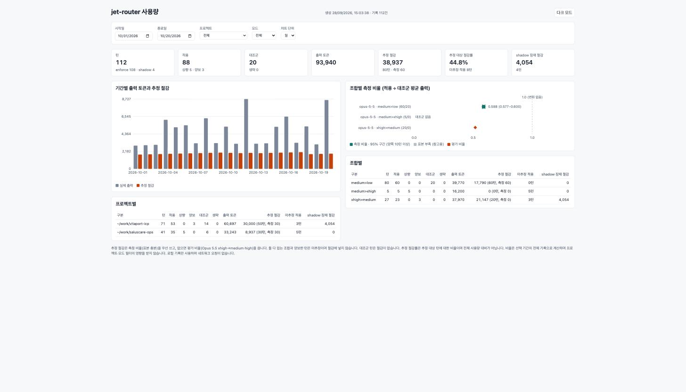

# jet-router 사용 가이드

[Claude Code·Codex 작동 다이어그램](architecture.md)에서 판정과 표시 시점을 비교할 수 있습니다.

## 1. 현재 가능한 것

현재는 **fake 또는 선택적 Jev의 off/shadow 관찰과 enforce(턴 단위 적용)**를 지원하며, 분류한 턴은 로컬 사용량 기록으로 남깁니다(7절). 기본 `fake`는 API 키 없이 설정된 고정값만 반환합니다. Jev는 별도 선택·외부 전송 동의·키가 모두 필요하며, 실패 시 다른 provider로 전환하지 않습니다.

Jev 연결은 로컬 mock과 [합성 입력 12건 실호출](evaluations/jev-smoke-2026-09-27.md)로 확인했습니다. 실제 Claude 세션 연결과 본격 품질 평가는 남아 있습니다. 자동 적용(enforce)은 `/jet-router enforce`로 켤 때만 동작합니다. 세션 시작 기본값은 항상 off 또는 shadow이며 enforce로 시작하지 않습니다.

## 2. 기본 effort와 프롬프트별 적용

기본 effort는 사용자 설정에 따라 `medium`, `high`, `xhigh` 등이 될 수 있습니다. 라우터는 설정 파일에서 기본값을 추측하지 않고 각 `turn.step`에 들어온 값을 읽습니다.

enforce는 **기본 설정을 바꾸지 않고 한 프롬프트의 턴에만 적용**합니다. “1회 적용”은 모델 HTTP 요청 한 번이 아니라, 해당 프롬프트의 답변이 끝날 때까지 이어지는 도구 루프를 포함합니다.

예를 들어 세션 설정이 `high`인 경우입니다. 하향·상향 추천을 모두 적용하며, 최대 `xhigh`까지입니다(`max`는 추천 후보가 아님).

| 프롬프트 | 요청에 들어온 기준값 | 턴별 적용 예 |
| --- | --- | --- |
| 오타 수정 | high | low |
| 일반 기능 구현 | high | medium |
| 복잡한 버그 분석 | high | xhigh |

첫 턴에 `low`를 적용해도 다음 프롬프트의 기본값이 `low`로 바뀌지는 않습니다. 사용자가 세션 설정을 `medium`으로 바꾸면 이후 요청에 들어오는 `medium`을 기준으로 판단합니다.

같은 턴의 도구 루프 요청에는 선택한 effort를 계속 적용합니다. 턴 도중 `/effort`로 값을 바꾸면 다음 요청부터 바뀐 값이 들어오므로, 그 턴의 남은 요청에는 적용을 멈추고 사용자의 값을 그대로 넘깁니다. 다음 턴은 새로 분류합니다. 턴 전체를 수동으로 제어하려면 `/jet-router lock` 또는 `/jet-router off`를 사용합니다.

다음 경우에는 적용하지 않고 요청 effort를 그대로 넘깁니다: `keep`·현재 값과 같은 추천, 분류 생략(시간 초과·오류·전송 미동의 등), `max` 요청, 잠금, 사용자가 입력하지 않은 턴. 적용 경로와 서버 반영은 [경로 확인 기록](evaluations/enforce-path-2026-09-28.md)에서 확인했습니다.

subagent는 따로 분류하지 않고, 자신을 띄운 메인 턴에 적용된 effort를 그대로 이어받습니다(상향 포함). 백그라운드로 도는 subagent도 메인 턴이 끝난 뒤까지 같은 값을 씁니다. 메인 턴이 적용하지 않았거나(keep·대조군·사용자 변경으로 중단) subagent에 들어온 effort를 사용자가 바꾼 경우, 그리고 메인 턴 없이 시작하는 `/subtask`는 그대로 넘깁니다. subagent 토큰은 `kind: "subagent"`로 따로 기록합니다([7절](#7-사용량-기록과-절감-리포트), [subagent 경로 확인](evaluations/subagent-step-2026-09-28.md)).

shadow에서는 위 표의 적용을 하지 않고 요청 effort를 그대로 유지합니다.

## 3. 로컬 폴더에서 적용하기

### 사전 확인

```sh
claude --version
```

오프라인 검증 버전은 `2.1.283`입니다. 플러그인은 Claude가 실행되는 머신에 있어야 합니다. Herdr에서 SSH로 원격 머신의 Claude를 사용하는 경우 로컬 Mac의 파일·설정만으로 원격 Claude에 적용되지 않습니다.

### Function hooks 활성화

기존 `~/.claude/settings.json`의 `env`에 아래 항목을 병합합니다. 파일 전체를 이 예시로 덮어쓰지 마세요. 이미 추가했다면 다시 수정할 필요가 없습니다.

```json
{
  "env": {
    "CLAUDE_CODE_ENABLE_FUNCTION_HOOKS": "1"
  }
}
```

설정을 저장하지 않고 한 프로세스에서만 켜려면 실행 명령 앞에 환경 변수를 지정합니다.

```sh
CLAUDE_CODE_ENABLE_FUNCTION_HOOKS=1 claude --plugin-dir /absolute/path/to/jet-router
```

`/absolute/path/to/jet-router`는 `.claude-plugin/plugin.json`이 있는 폴더입니다. 현재 개발 worktree를 테스트한다면 그 worktree 경로를 사용합니다. 실제 작업할 프로젝트의 디렉터리에서 실행하면 됩니다.

`--plugin-dir`는 해당 세션에만 플러그인을 로드합니다. 전역 marketplace 설치는 필요하지 않습니다. 패키지 설치나 빌드도 필요하지 않습니다. [공식 플러그인 안내](https://code.claude.com/docs/en/plugins)

### 기존 대화 이어서 사용하기

이미 실행 중인 Claude 프로세스에 새 CLI 옵션을 소급 적용할 수는 없습니다. 작업을 정리하고 종료한 뒤, 같은 프로젝트에서 대화를 선택해 재개하는 CLI 형태는 다음과 같습니다.

```sh
claude --resume --plugin-dir /absolute/path/to/jet-router
```

활성화 환경 변수를 설정하지 않았다면 앞에 `CLAUDE_CODE_ENABLE_FUNCTION_HOOKS=1`을 붙입니다. 이 조합의 실제 대화 재개는 아직 수동 검증하지 않았습니다. 시작 후 `/jet-router status`로 로드 여부를 확인합니다. 새로 시작·재개한 세션의 라우터는 기본 off이며, 시작할 때 현재 모드를 한 줄로 표시합니다. 시작 모드는 아래 `defaultMode`로 바꿀 수 있습니다.

## 4. 사용 순서와 명령어

1. `/jet-router status`로 초기 off 상태를 확인합니다.
2. `/jet-router shadow`로 관찰 모드를 켭니다.
3. 일반 프롬프트를 입력하고 답변이 끝나면 요약 줄을 확인합니다.
4. 관찰을 끝내려면 `/jet-router off`를 실행합니다.

| 명령 | 동작 |
| --- | --- |
| `/jet-router status` | 현재 모드·잠금·분류기·외부 전송 여부·최근 완료 결과 |
| `/jet-router shadow` | 선택한 분류기 관찰 시작, 실제 effort 변경 없음 |
| `/jet-router off` | 분류 중지, 진행 중 판단 무효화 |
| `/jet-router lock` | 현재 모드를 유지하며 분류 일시 정지 |
| `/jet-router unlock` | 잠금 해제. off였다면 계속 off |
| `/jet-router enforce` | 추천 effort를 해당 턴에만 적용 (세션 기본값 변경 없음) |
| `/jet-router report [기준] [html]` | 사용량·절감 리포트. 기준 `day`(기본)·`week`·`month`·`project`·`model`·`mode`·`pair`·`all`, `html`이면 `~/.claude/jet-router/usage-report.html` 생성 |

`on` 명령은 없습니다. 잠금 상태에서 shadow를 선택해도 잠금은 유지됩니다. 상태의 “최근 완료”는 이전 턴 기록이며 현재 모드와 다를 수 있습니다. 새 세션에서 초기화됩니다.

## 5. 추천 테스트값 바꾸기

`defaultMode` 옵션은 세션을 시작·재개할 때의 모드를 정합니다. `off`(기본값) 또는 `shadow`를 받습니다. `shadow`를 고르면 fake·Jev 모두 shadow로 시작합니다. Jev에서는 전송 동의(`cloudConsent`) 후 **모든 세션의 분류 대상 프롬프트가 Jev로 전송**되므로 명시적으로 고른 경우에만 적용되며, 기본값은 off입니다. enforce는 시작 모드로 둘 수 없고 세션마다 `/jet-router enforce`로 켭니다. `/reload-plugins`로 새 버전을 불러오면 새 모듈이 세션 시작 처리를 다시 하므로 이 시작 모드로 돌아가며, enforce는 다시 켜야 합니다. 시작 시 표시 예시입니다.

```text
jet-router: 세션 시작 · 관찰(shadow) · Jev · 적용: /jet-router enforce
jet-router: 세션 시작 · 꺼짐(off) · Jev · 켜기: /jet-router shadow(관찰) · enforce(적용)
```


`fakeChoice` 옵션은 `keep`(기본값), `low`, `medium`, `high`, `xhigh`를 받습니다. 잘못된 값은 `keep`으로 처리합니다.

설치된 플러그인은 `/plugin`의 Installed에서 jet-router를 선택하고 **Configure options**에서 값을 바꿀 수 있습니다. 변경 후 Claude가 안내하는 reload/재시작 절차를 따릅니다. 이 플러그인의 설정 UI 경로는 아직 수동 실행하지 않았습니다. [공식 관리 방법](https://code.claude.com/docs/en/discover-plugins#manage-installed-plugins)

기본 `keep` fixture는 맥락 충분 여부를 false로 반환하므로 `high 유지(고정값)`처럼 현재 요청 effort 유지로 표시합니다. `low`로 설정하면 모든 분류 대상에 low를 추천합니다. 어느 쪽도 실제 요청의 난도를 판단한 결과는 아닙니다.

### Jev shadow 설정

Node 22+ 실행 파일이 Claude 프로세스의 PATH에 있어야 합니다. `/plugin` → Installed → jet-router → Configure options에서 다음을 설정한 뒤 안내에 따라 reload/재시작합니다. 키 입력 UI의 실제 저장·재로드는 아직 수동 검증하지 않았습니다.

| 옵션 | 값·의미 |
| --- | --- |
| `provider` | 기본 `fake`. Jev를 쓰려면 `jev` 선택 |
| `cloudConsent` | 기본 false. 현재 프롬프트와 effort의 TypeSafe 외부 전송에 동의할 때만 true |
| `jevApiKey` | TypeSafe API 키. sensitive 옵션으로 Claude의 secure storage 사용. 채팅·명령 인자·저장소에 적지 않음 |

동의 전 TypeSafe의 데이터 처리·보관 정책을 확인하세요. 이 구현은 해당 정책이나 계정 요금·한도를 검증하지 않았습니다. 설정만으로 전송하지는 않으며, 새 세션은 off입니다. `/jet-router status` 확인 후 `/jet-router shadow`에서 분류 대상 입력이 전송됩니다. API 키가 없거나 잘못된 형식이면 전송을 생략합니다.

전송 대상은 `https://api.typesafe.ai/v1/systemone`으로 고정되어 있습니다. 현재 프롬프트(최대 6,000자)·현재 effort·고정 분류 질문만 보내며 파일, 전체 대화, 시스템 지침은 수집하지 않습니다. `taskContext`는 null입니다. 이 제한이 프롬프트 자체에 포함된 비밀을 제거해 주지는 않으므로 민감한 입력 전에는 off/lock을 사용하세요.

모든 redirect를 거부하고 재시도·자동 fallback을 하지 않습니다. helper 입력·응답은 각각 64 KiB 한도이며 응답 한도는 다운로드 중 적용됩니다. hook의 대기 한도는 1초, helper의 HTTPS 전체 요청 한도는 3초, 호스트 process 한도는 4초입니다. Node 시작 시간 등은 별도이므로 이 값은 실제 완료 시간 보장이 아닙니다. 느린 호출은 추천을 표시하지 않을 수 있습니다.

`off`, lock, 새 입력, 중단 또는 대기 timeout은 늦은 결과를 무효화합니다. 이미 시작된 HTTPS 요청이 즉시 취소되거나 비용이 없어지는 것은 보장하지 않습니다. 아직 끝나지 않은 helper가 있으면 다음 분류를 생략하여 같은 활성화 내 요청이 중첩되지 않게 합니다.

## 6. 메시지 읽기

응답 본문을 수정하지 않고 메인 턴 종료 후 별도의 로그 한 줄을 출력합니다. 도구 요청마다 중복 출력하지 않습니다. 아래 시간은 예시입니다.

형식은 Codex MCP shadow 안내([Codex MCP 가이드](codex-mcp.md))와 같고, Claude Code가 플러그인 출력 앞에 `jet-router:`를 붙이므로 본문의 `[jet-router]` 태그는 생략합니다(0.11.1~). 화살표 왼쪽은 이 턴의 요청 effort, 오른쪽은 추천값입니다. 추천이 keep이면 화살표 대신 `<요청 effort> 유지`로 표시합니다. 추천이 있어도 shadow에서는 원래 effort를 유지합니다. fake 결과에는 `(고정값)`이 붙습니다.

```text
jet-router: fake.shadow(): high → low(고정값) · 12ms
jet-router: fake.shadow(): medium → xhigh(고정값) · 9ms
jet-router: fake.shadow(): high 유지(고정값) · 8ms
```

분류를 생략·실패한 경우는 `생략:`으로 구분하고 지연값을 표시하지 않습니다.

```text
jet-router: fake 생략: max 보호 · shadow
jet-router: fake 생략: 시간 초과 · shadow
jet-router: fake 생략: 요청 연결 불확실 · shadow
```

timeout은 실패 경로의 표시 예시이며 정상 fake는 즉시 결과를 반환합니다. 분류할 수 없는 입력은 생략 사유를 표시합니다: `입력 겹침`(턴 도중·동시 제출), `대기 중 입력`, `첨부 포함`, `숨은 문맥 포함`, `빈 입력`, `6,000자 초과`, `스킬·명령 입력`(`/`로 시작해 턴 시작 전에 펼쳐지는 입력), `입력 변경됨`(다른 훅이 입력을 바꿈). 어느 것에도 해당하지 않는 연결 실패만 `요청 연결 불확실`로 표시합니다. subagent 보고·백그라운드 작업 완료 알림처럼 사용자가 입력하지 않은 턴은 요약을 출력하지 않습니다. 턴 도중 요청 effort가 바뀌면 `마지막 요청 …`이, 턴이 중단되면 끝에 `중단`(`오류`·`거절`)이 붙습니다. 분류 완료 전에 중단되었거나 off·잠금·세션 전환으로 결과가 무효화됐다면 요약은 생략될 수 있습니다.

```text
jet-router: fake.shadow(): high → low(고정값) · 12ms · 마지막 요청 medium
jet-router: fake.shadow(): high → low(고정값) · 12ms · 중단
```

상태 조회 예시입니다.

```text
jet-router: 모드: 관찰(shadow) — 추천만 표시
분류기: fake(고정 테스트 결과) · 외부 전송: 없음
수동 잠금: 꺼짐
effort 자동 변경: 꺼짐 — 켜기: /jet-router enforce
최근 완료: fake.shadow(): high → low(고정값) · 12ms
```

Jev shadow의 표시 예시입니다. Jev 추천은 응답 형식만 검증했으며 추천 정확도와 정책 임계값은 아직 미평가입니다. 맥락·위험 점수에 임의의 기준값을 적용하지 않습니다. `(70%)`는 선택된 후보의 `selectedProbability`를 반올림한 값이며, 응답에 없으면 생략합니다. 신뢰도나 작업 성공 확률이 아닙니다.

```text
jet-router: Jev.shadow(): medium → low (70%) · 180ms
jet-router: Jev.shadow(): medium 유지 (66%) · 376ms
jet-router: Jev 생략: 전송 미동의 · shadow
jet-router: Jev 생략: redirect 차단 · shadow
```

enforce의 표시 예시입니다. `적용`은 해당 턴의 요청 effort를 바꿨다는 뜻입니다.

```text
jet-router: Jev.enforce(): xhigh → medium 적용 (71%) · 353ms
jet-router: Jev.enforce(): medium → xhigh 적용 (80%) · 310ms
jet-router: Jev.enforce(): high 유지 (66%) · 376ms
jet-router: Jev.enforce(): xhigh → medium 적용 (71%) · 353ms · 마지막 요청 high · 사용자 변경으로 적용 중단
jet-router: Jev 생략: 시간 초과 · enforce
```

`유지`는 라우터가 다음 훅에 넘긴 요청값을 설명합니다. 서버 수신이나 모델 내부 추론량을 증명하지 않습니다. 지연은 전체 Claude 응답 시간이 아니라 분류 대기 시간입니다. 신뢰도·비용 절감량은 현재 표시하지 않습니다.

## 7. 사용량 기록과 절감 리포트

shadow·enforce로 분류한 사용자 턴은 턴이 끝날 때 한 줄씩 `~/.claude/jet-router/usage/YYYY-MM.jsonl`에 기록합니다(권한 600, 로컬 전용). 그 턴이 띄운 subagent도 subagent 턴이 끝날 때 `kind: "subagent"`로 따로 한 줄 기록합니다(0.11.0~, 이전 기록은 `main`).

- 기록 항목: 시각, 구분(`kind`: main·subagent), 프로젝트(`cwd`), 모델, 모드, 원래·추천·적용 effort, 양보 여부, 생략 사유, 확률, 분류 지연, 턴 시간, 턴 합계 토큰(입력·출력·캐시 읽기·캐시 쓰기). 토큰은 Claude Code가 턴 종료 훅에 넘기는 값입니다.
- subagent 줄의 effort·대조군 여부는 자신을 띄운 메인 턴의 결정을 이어받고, 토큰은 subagent 턴 합계입니다(메인 턴 합계에는 subagent 토큰이 들어가지 않습니다). 메인 턴이 대조군이면 그 subagent도 대조군입니다.
- 기록하지 않는 것: 프롬프트·답변 원문, API 키, off 모드 턴, 알림 턴, 메인 턴 없이 시작한 subagent(`/subtask` 등).
- 끄기: `/plugin` → jet-router → Configure → `Record local token usage`를 false로 설정합니다.

리포트는 네트워크 호출 없이 로컬 파일만 읽습니다. 세션 안에서는 `/jet-router report`(`project`·`week` 등 기준, `html` 옵션)로, 터미널에서는 아래 스크립트로 봅니다. 설치본 경로는 [README](../README.md#절감-현황-보기)를 참고합니다.

```text
node scripts/usage.mjs report --by day
node scripts/usage.mjs report --by week --from 2026-10-01 --to 2026-10-31
node scripts/usage.mjs report --by project,pair
node scripts/usage.mjs report --by month --json
```

`--by`는 `day|week|month|project|model|mode|kind|pair|all`을 쉼표로 조합합니다. `kind`는 메인 턴과 subagent를 나눕니다. 날짜는 로컬 시간 기준입니다.

**HTML 대시보드.** `node scripts/usage.mjs report --html [파일]`은 브라우저로 여는 파일 하나를 만듭니다(기본 `jet-router-usage.html`, `--from`/`--to`로 포함 기간 제한). 외부 스크립트·네트워크 요청 없이 로컬에서만 동작합니다.

- 구성: 요약 카드, 기간별 실제 출력·추정 절감 차트(일·주·월), 조합별 측정 비율과 95% 구간 차트(평가 비율은 마름모로 표시), 프로젝트별·조합별 표.
- 필터: 기간, 프로젝트, 모드, 구분(메인 턴·subagent). 페이지 안에서 CLI와 같은 집계 코드를 다시 실행하므로 결과가 CLI와 같습니다. 측정 비율은 프로젝트·모드·구분 필터와 관계없이 선택 기간 전체 기록으로 계산하며, 메인 턴과 subagent를 따로 계산합니다(subagent에는 평가 비율을 쓰지 않습니다).
- 화면 폭 1100px 이상에서는 카드 한 줄과 차트·표 2단으로, 좁은 화면에서는 1단으로 배치합니다. 기본은 라이트 모드이며 오른쪽 위 버튼으로 다크 모드로 바꿉니다.
- 파일에는 선택 기간의 기록(프로젝트 경로 포함, 홈 경로는 `~`로 표시)이 들어 있습니다. 공유할 때 유의합니다.



```text
node scripts/usage.mjs report --html
node scripts/usage.mjs report --html ~/Desktop/jet-router-10월.html --from 2026-10-01 --to 2026-10-31
open jet-router-usage.html
```

**대조군.** enforce에서 적용할 수 있는 턴 중 `Enforce control share`(`holdoutRate`, 기본 0.1) 비율은 무작위로 적용하지 않고 원래 effort로 실행합니다. 요약에는 `… → … 대조군 미적용`으로 표시됩니다. 리포트는 같은 모델·조합의 적용 턴과 대조군 턴 평균 출력을 비교해 실제 작업에서의 비율을 측정합니다. 양쪽 모두 10턴 이상 모이면 그 비율과 95% 부트스트랩 구간을 쓰고, 턴 도중 사용자가 effort를 바꾼 턴은 양쪽에서 뺍니다. 대조군 턴에서는 그만큼 절감을 포기합니다. `0`으로 설정하면 대조군 없이 모두 적용합니다.

**추정 절감의 범위.** 적용하지 않았을 때의 토큰은 관측할 수 없으므로 추정합니다. 적용 턴은 `실제 출력 ÷ 비율 − 실제 출력`으로 계산하며, 비율은 다음 순서로 고릅니다.

1. **측정 비율**: 위 대조군 비교에서 표본이 충분한 조합. 상향 조합은 비율이 1보다 커서 절감이 음수(증가)로 들어갑니다.
2. **평가 비율**: [Claude 하향 비교](evaluations/downshift-claude-2026-09-28/README.md)에서 측정한 Opus 5.5의 xhigh→medium(0.517)·xhigh→high(0.547). 합성 과제 4개에서 얻은 값이라 실제 작업의 절감률을 보장하지 않습니다.
3. 둘 다 없거나 턴 도중 사용자 변경으로 양보한 턴은 `미추정`으로 따로 세며 절감에 넣지 않습니다.

shadow 턴은 원래 effort로 실행됐으므로 `실제 출력 × (1 − 비율)`을 잠재 절감으로만 표시합니다. 비율은 조회 기간 전체의 기록으로 계산합니다. 금액은 표시하지 않습니다.

**예상 출력.** 아래는 예시 기록 34건으로 실제 스크립트를 실행한 출력입니다. 예시 데이터에는 xhigh→medium 적용 3건(1건은 턴 도중 사용자 변경으로 양보)과 대조군 2건, xhigh→high 1건, medium→xhigh 상향 1건, keep 1건, shadow xhigh→medium 추천 1건, medium→low 적용 13건과 대조군 12건이 있습니다.

```text
$ node scripts/usage.mjs report --by day
기간: 처음 ~ 끝 · 기준: day · 추정 대상 턴 출력 절감률 44.0%
구분        턴  적용  상향  양보  대조군  생략  출력 토큰              추정 절감  미추정 적용  shadow 잠재 절감
2026-10-01   4     3     0     0       0     0      5,820    2,733 (3턴, 측정 1)          0턴           0 (0턴)
2026-10-02   6     3     1     1       2     0     12,480      923 (1턴, 측정 0)          2턴       1,038 (1턴)
2026-10-03   8     4     0     0       4     0      4,370    1,115 (4턴, 측정 4)          0턴           0 (0턴)
2026-10-04   8     4     0     0       4     0      4,575    1,205 (4턴, 측정 4)          0턴           0 (0턴)
2026-10-05   8     4     0     0       4     0      4,545    1,230 (4턴, 측정 4)          0턴           0 (0턴)
합계        34    18     1     1      14     0     31,790  7,207 (16턴, 측정 13)          2턴       1,038 (1턴)

측정 비율 (적용 ÷ 대조군 평균 출력, 양쪽 10턴 이상일 때 사용)
모델 · 조합                     적용 턴  대조군 턴  적용 평균  대조군 평균   비율     95% 구간       상태
claude-opus-5-5 · medium>low         13         12        414          710  0.583  0.557–0.610       사용
claude-opus-5-5 · medium>xhigh        1          0      3,100            -      -            -  표본 부족
claude-opus-5-5 · xhigh>high          1          0      1,720            -      -            -  표본 부족
claude-opus-5-5 · xhigh>medium        2          2      1,035        1,970  0.525            -  표본 부족

추정 절감은 측정 비율(표본 충분)을 우선 쓰고, 없으면 평가 비율(Opus 5.5 xhigh→medium·high)을 씁니다. 둘 다 없는 조합과 양보한 턴은 미추정으로 절감에 넣지 않습니다. 대조군 턴은 절감이 없습니다. subagent 턴(kind=subagent)은 subagent끼리 측정한 비율만 씁니다.
```

```text
$ node scripts/usage.mjs report --by pair
기간: 처음 ~ 끝 · 기준: pair · 추정 대상 턴 출력 절감률 44.0%
구분          턴  적용  상향  양보  대조군  생략  출력 토큰              추정 절감  미추정 적용  shadow 잠재 절감
medium>low    25    13     0     0      12     0     13,910  3,850 (13턴, 측정 13)          0턴           0 (0턴)
medium>xhigh   1     1     1     0       0     0      3,100        0 (0턴, 측정 0)          1턴           0 (0턴)
xhigh>high     1     1     0     0       0     0      1,720    1,426 (1턴, 측정 0)          0턴           0 (0턴)
xhigh>keep     1     0     0     0       0     0      2,600        0 (0턴, 측정 0)          0턴           0 (0턴)
xhigh>medium   6     3     0     1       2     0     10,460    1,931 (2턴, 측정 0)          1턴       1,038 (1턴)
합계          34    18     1     1      14     0     31,790  7,207 (16턴, 측정 13)          2턴       1,038 (1턴)

측정 비율 (적용 ÷ 대조군 평균 출력, 양쪽 10턴 이상일 때 사용)
모델 · 조합                     적용 턴  대조군 턴  적용 평균  대조군 평균   비율     95% 구간       상태
claude-opus-5-5 · medium>low         13         12        414          710  0.583  0.557–0.610       사용
claude-opus-5-5 · medium>xhigh        1          0      3,100            -      -            -  표본 부족
claude-opus-5-5 · xhigh>high          1          0      1,720            -      -            -  표본 부족
claude-opus-5-5 · xhigh>medium        2          2      1,035        1,970  0.525            -  표본 부족

추정 절감은 측정 비율(표본 충분)을 우선 쓰고, 없으면 평가 비율(Opus 5.5 xhigh→medium·high)을 씁니다. 둘 다 없는 조합과 양보한 턴은 미추정으로 절감에 넣지 않습니다. 대조군 턴은 절감이 없습니다. subagent 턴(kind=subagent)은 subagent끼리 측정한 비율만 씁니다.
```

읽는 법:

- `적용`: enforce가 effort를 바꾼 턴입니다. `상향`과 `양보`는 그중 올린 턴과 턴 도중 사용자 변경으로 적용을 멈춘 턴입니다. `대조군`은 무작위로 적용하지 않은 턴입니다.
- `생략`: 분류하지 못해 적용하지 않은 턴입니다(시간 초과, 스킬 명령 등).
- `추정 절감 (N턴, 측정 M)`: 적용된 N턴에서 줄었다고 추정한 출력 토큰이고, M은 그중 측정 비율을 쓴 턴 수입니다. 첫 줄의 `추정 대상 턴 출력 절감률`은 이 턴들에 대한 비율이며, 전체 사용량 대비 절감률이 아닙니다.
- `미추정 적용`: 적용했지만 절감을 계산하지 않은 턴입니다. 위 예시에서는 표본이 부족한 medium→xhigh 상향 1건과 양보 1건입니다.
- `측정 비율` 표: 조합별 적용·대조군 턴 수와 평균 출력, 비율, 95% 구간입니다. 예시의 medium→low는 비율 0.583(구간 0.557–0.610)으로 측정돼 추정에 쓰였고, 나머지는 `표본 부족`이라 평가 비율 또는 미추정으로 처리됐습니다.
- `shadow 잠재 절감`: shadow 턴에서 추천대로 적용했다면 줄었을 것으로 추정한 양입니다. 실제로 절감된 양이 아닙니다.
- `--json`은 같은 집계를 필드별로 출력합니다. `factors`(측정 비율 표), `estimatedBaselineOutput`(적용 안 했을 때의 추정 출력), `unestimatedAppliedOutput`, 입력·캐시 토큰 합계가 추가로 들어 있습니다.

## 8. 로컬·공개 marketplace 설치

폴더 직접 로드가 아닌 설치 방식이 필요할 때만 사용합니다. 다음은 Claude 세션 안에서 실행하는 명령이며 사용자 설정·설치 상태를 변경합니다.

```text
/plugin marketplace add /absolute/path/to/jet-router
/plugin install jet-router@jet-router
```

코드와 manifest는 공개 저장소에 게시했습니다. 현재 원격 기본 브랜치는 `main`입니다. Claude 세션 안에서 다음 형태로 설치합니다.

```text
/plugin marketplace add jetsongdev/jet-router
/plugin install jet-router@jet-router
```

설치 범위를 확인하고, 로드가 보류되면 화면의 안내를 따릅니다. GitHub marketplace 추가 및 설치 형식의 근거는 [공식 설치 문서](https://code.claude.com/docs/en/discover-plugins#add-a-marketplace)입니다. 원격 새 clone의 테스트·manifest 검증은 통과했지만 이 두 marketplace 설치 절차는 jet-router에서 실제 실행하지 않았습니다.

## 9. 중지와 문제 해결

| 상황 | 확인할 내용 |
| --- | --- |
| `/jet-router` 명령이 없음 | 폴더 경로, 활성화 환경 변수, `/plugin`의 Errors, 실행 버전 |
| 추천 줄이 안 나옴 | off 또는 lock인지, 턴이 끝났는지, 입력이 생략 조건에 해당하는지 |
| 늘 같은 추천이 나옴 | fake의 정상 동작. Jev 분류가 아님 |
| high가 low로 안 바뀜 | 현재 shadow는 추천만 표시함 |
| 새 세션에서 꺼져 있음 | 초기값 off가 정상. fake는 `defaultMode=shadow`로 자동 시작 가능, Jev는 필요할 때 shadow 실행 |
| 변경한 코드가 안 보임 | 최신 worktree 경로인지 확인하고 세션을 다시 로드 |

큐에 넣은 입력, 턴 도중 추가 입력, 중복 제출, 첨부파일, 추가 숨은 문맥, 비사용자 출처, 다른 훅에서 수정된 입력, 6,000자 초과 입력, 불명확한 턴 연결은 보수적으로 건너뜁니다. subagent·max·미지원 effort도 분류하지 않습니다.

즉시 관찰을 중지하려면 `/jet-router off`를 사용합니다. 직접 로드한 플러그인을 제외하려면 다음 실행에서 `--plugin-dir`를 빼세요. marketplace로 설치했다면 `/plugin`에서 jet-router를 비활성화하거나 제거합니다. 라우터를 중지하려고 다른 플러그인도 사용하는 function-hook 환경 변수를 일괄 제거할 필요는 없습니다.

프롬프트·키·오류 본문은 요약에 넣지 않고 별도 로그 파일도 만들지 않습니다. UI 로그는 Claude 자체 대화 기록에 남을 수 있습니다. 기본 fake는 외부로 보내지 않습니다. 동의한 Jev shadow에는 별도 API 비용이 발생할 수 있으며, 일반 Claude 응답에도 원래 서비스 사용량·비용이 적용됩니다.

실제 설치 후에는 [테스트 체크리스트](test-checklist.md)를 순서대로 진행하고 결과를 기록합니다.

## 10. 개발 검증

플러그인 폴더에서 실행합니다. Node 22+가 필요하며 의존성 설치는 필요하지 않습니다.

```sh
npm test
npm run validate
npm run test:hooks
```

현재 기록은 Node 테스트 43개와 Claude 오프라인 hook 테스트 2개(fake/Jev 각 1개) 통과입니다. 실제 터미널 표시, 기존 대화 재개, marketplace 설치, Claude 실제 요청은 검증하지 않았습니다. 별도 helper를 통한 Jev 합성 입력 실호출은 12건 완료했습니다. 자세한 범위는 [구현 기록](implementation.md), 공식 계약의 한계는 [호환성 조사](compatibility.md)를 참고하세요.


### 개발용 평가 실행기

`node scripts/evaluate-jev.mjs --dry-run`은 키를 읽거나 전송하지 않고 고정 합성 입력의 해시·크기만 출력합니다. 승인된 실호출은 `--live --key-env TYPESAFE_API_KEY` 또는 `--live --key-file /absolute/path/to/.env`로 실행합니다. 후자는 TYPESAFE_API_KEY만 파싱하고 쉘 코드를 실행하지 않습니다. 최대 12회이며 첫 전송/응답 오류에서 중단하고 재시도하지 않습니다. 이 실행기는 플러그인 설정을 저장하거나 활성화하지 않습니다.
